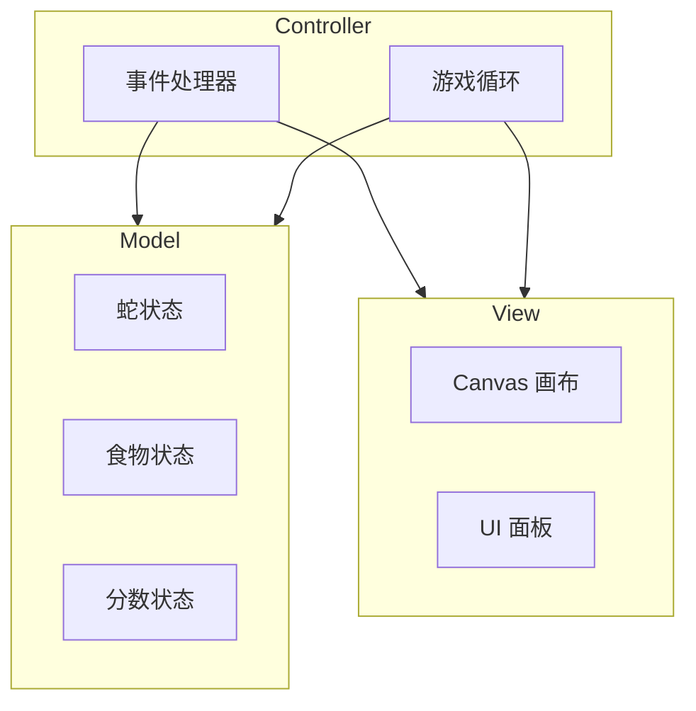

# 贪吃蛇游戏开发指南

> 本文档面向游戏开发者，介绍如何开发和扩展贪吃蛇游戏

## 目录

- [架构概述](#架构概述)
- [开发环境](#开发环境)
- [代码结构](#代码结构)
- [扩展开发](#扩展开发)
- [测试](#测试)
- [构建部署](#构建部署)

---

## 架构概述

游戏采用经典的 MVC 架构：



---

## 开发环境

### 必需工具

- 现代浏览器（推荐 Chrome DevTools）
- 代码编辑器（VS Code、Sublime Text 等）

### 可选工具

```bash
# 本地开发服务器
npm install -g http-server
# 或
pip3 install http.server
```

---

## 代码结构

```
snake/
├── index.html      # 入口页面，定义 DOM 结构
├── style.css       # 样式表，像素复古风格
├── game.js         # 游戏主逻辑
└── README.md       # 用户文档
```

### 核心模块

| 文件 | 行数 | 职责 |
|------|------|------|
| `game.js` | ~300 | 游戏循环、状态管理、渲染逻辑 |

### `game.js` 函数清单

```
初始化
├── init()                 # 初始化游戏
├── setupEventListeners()  # 绑定事件监听器

游戏控制
├── startGame()            # 开始新游戏
├── togglePause()          # 切换暂停
├── changeDifficulty()     # 改变难度
├── gameOver()             # 游戏结束处理

游戏循环
├── update()               # 更新游戏状态
├── draw()                 # 绘制画面
├── drawGrid()             # 绘制网格
├── spawnFood()            # 生成食物

辅助
├── handleKeyPress()       # 键盘输入处理
└── updateSnakeSet()       # 更新蛇身 Set
```

---

## 扩展开发

### 添加新难度

1. 在 `CONFIG.speeds` 中添加新速度：

```javascript
const CONFIG = {
    speeds: {
        easy: 200,
        medium: 150,
        hard: 100,
        extreme: 50  // 新增
    }
};
```

2. 在 HTML 中添加选项：

```html
<option value="extreme">极限</option>
```

### 添加新食物类型

修改 `COLORS` 和 `spawnFood()` 逻辑：

```javascript
const FOOD_TYPES = [
    { color: '#ff6b6b', points: 10 },   // 普通
    { color: '#ffd700', points: 20 },   // 金色
    { color: '#ff69b4', points: 30 }    // 粉色
];
```

### 修改蛇的外观

调整 `COLORS` 配置：

```javascript
const COLORS = {
    snakeHead: '#你的颜色',
    snakeBody: '#你的颜色'
};
```

---

## 测试

### 手动测试清单

- [ ] 游戏启动正常
- [ ] 蛇可以正常转向
- [ ] 吃到食物后分数增加、蛇身变长
- [ ] 撞墙或撞自己时游戏结束
- [ ] 暂停/继续功能正常
- [ ] 难度切换生效
- [ ] 最高分持久化正常

### 调试技巧

使用浏览器 DevTools:

```javascript
// 在控制台查看当前状态
console.log(snake);
console.log(score);
console.log(direction);
```

---

## 构建部署

### 静态部署

游戏为纯前端项目，可直接部署到任意静态托管：

```bash
# 1. 上传 snake/ 目录到服务器
# 2. 配置 Web 服务器指向 index.html
```

### 推荐托管平台

| 平台 | 特点 |
|------|------|
| GitHub Pages | 免费，与 Git 集成 |
| Netlify | 免费，自动部署 |
| Vercel | 免费，全球 CDN |

### GitHub Pages 部署

```bash
# 推送到 GitHub 后
# 设置 -> Pages -> 选择 main 分支
# 访问 https://username.github.io/repo-name/snake/
```

---

## 性能优化

当前版本已实现的优化：

| 优化项 | 实现方式 |
|--------|----------|
| 碰撞检测 | Set O(1) 查找 |
| 防抖更新 | requestAnimationFrame |
| 常量提取 | 避免重复创建对象 |
| 预计算 | CONFIG.gridCount getter |

---

## 常见问题

### Q: 如何修改画布大小？

修改 `CONFIG.canvasSize` 并同步调整 HTML 中 canvas 的 width/height：

```javascript
const CONFIG = {
    canvasSize: 600  // 改为 600x600
};
```

### Q: 如何加快游戏速度？

修改 `CONFIG.speeds` 中的数值（毫秒越小越快）：

```javascript
speeds: {
    easy: 100,   // 原来是 200
    medium: 80,  // 原来是 150
    hard: 50     // 原来是 100
}
```

### Q: 如何修改网格大小？

修改 `CONFIG.gridSize`：

```javascript
const CONFIG = {
    gridSize: 10  // 更小的网格，更精细
};
```

---

## 版本历史

| 版本 | 日期 | 变更 |
|------|------|------|
| 1.0 | 2026-04-03 | 初始版本 |
| 1.1 | 2026-04-05 | 性能优化：O(1) 碰撞检测、防抖更新 |
