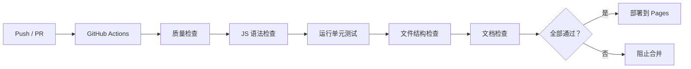

# 测试文档

## 测试架构

游戏测试分为两层：

| 层级 | 文件 | 说明 |
|------|------|------|
| 核心逻辑 | `game-core.js` | 纯函数，可测试 |
| DOM 绑定 | `game.js` | 浏览器环境，手动测试 |
| 单元测试 | `tests/game.test.js` | 测试核心逻辑 |

## 运行测试

### 本地运行

```bash
cd snake
node tests/run-tests.js
```

### CI 中运行

GitHub Actions 会在每次 Push/PR 时自动运行测试。

## 测试覆盖

### 已覆盖的功能

| 模块 | 测试数 | 覆盖内容 |
|------|--------|----------|
| CONFIG | 2 | 网格数量、难度速度 |
| DIRECTION_MAP | 2 | 方向键、WASD 映射 |
| handleDirection | 4 | 同向、90 度转向、180 度反向阻止 |
| parseKeyInput | 4 | 大小写、方向键、无效输入 |
| calculateNewHead | 4 | 四个方向移动计算 |
| checkWallCollision | 6 | 四面墙、边界内、边界位置 |
| checkSelfCollision | 3 | 蛇身碰撞、空位置、空蛇身 |
| checkFoodCollision | 2 | 碰撞、不碰撞 |
| moveSnake | 3 | 保持长度、增长、空蛇身 |
| spawnFood | 2 | 避开蛇身、随机函数注入 |
| calculateScore | 2 | 默认 10 分、自定义分数 |
| isNewHighScore | 3 | 新记录、低于记录、等于记录 |
| getEyeOffsets | 5 | 四个方向、无效方向 |
| GameState | 3 | 初始化、重置、蛇身 Set |
| gameUpdate | 6 | 暂停、结束、移动、吃食物、撞墙、撞自己 |
| togglePause | 1 | 切换状态 |
| changeDifficulty | 2 | 改变速度、无效难度 |

### 边界值测试

```
位置边界:
- x = -1 (左墙外)
- x = 0 (左边界)
- x = 19 (右边界)
- x = 20 (右墙外)

方向:
- (1, 0)   右
- (-1, 0)  左
- (0, -1)  上
- (0, 1)   下
- (0, 0)   无效

分数:
- 0 (初始)
- 50 (记录)
- 51 (破记录)
- 100 (新记录)
```

## 新增测试用例

如需添加新功能的测试，遵循以下模式：

```javascript
describe('新函数名', () => {
    it('应该处理正常情况', () => {
        // 测试代码
    });

    it('应该处理边界情况', () => {
        // 测试代码
    });

    it('应该处理异常情况', () => {
        // 测试代码
    });
});
```

## 测试工具

项目使用自研的轻量测试框架（`tests/test-utils.js`）：

| 断言 | 说明 |
|------|------|
| `expect(x).toBe(y)` | 严格相等 |
| `expect(x).toEqual(y)` | 深度相等 |
| `expect(x).toBeNull()` | 为 null |
| `expect(x).toBeTruthy()` | 为真 |
| `expect(x).toBeFalse()` | 为假 |
| `expect(x).toBeGreaterThan(y)` | 大于 |

## 测试与 CI/CD



## 手动测试清单

单元测试之外的手动测试：

- [ ] 游戏在浏览器中正常渲染
- [ ] 蛇可以正常转向
- [ ] 吃到食物后蛇身变长
- [ ] 撞墙时游戏结束
- [ ] 撞自己时游戏结束
- [ ] 暂停功能正常
- [ ] 难度切换生效
- [ ] 最高分持久化
